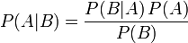

##2. Markov-beslutsprocess

Markov-beslutsprocess, ofta förkortat MDP (Markov Decision Process) är en algoritm för planering i situationer med slumpfaktorer, så kallad stokastisitet. Planeringsalgoritmen Markov-beslutsprocesser har många namn beroende på från vilken bakgrund kommer in på ämnet, MDP:n är även kända som Kontrollerade Markovprocesser, Kontrollerade Markovkedjor, Markov-beslutskedjor [1]. Algoritmen presenterades första gången av Richard E. Bellman år 1957 i Journal of Mathematics and Mechanics[1*]. Markov-beslutsprocesser används i dag med stor framgång i bland annat robotik, ekonomi, tillverkningsindustri, spel och automatiserad styrning av processer.

Markov-beslutsprocesser är, som alla planeringsalgoritmer en typ optimeringsalgoritm. Optimeringsmålet för MDP:n är att hitta den bästa möjliga strategi för att agera efter i alla diskreta situationer. Detta optimeringsmål skilljer sig från t.ex. grafsökning vars mål är att hitta en optimal lösning för problemet (eller ett delproblem) och sedan agera efter den lösningsstrategin.

###2.1. Varför Markov-beslutsprocesser

Efter som det finns en hel del olika planeringsalgoritmer så är frågan: "när skall man använda just Markov-beslutsprocesser?" en mycket relevant fråga och ett bra sätt att få en överblick på ekosystemet för planeringsalgoritmer inom artificiell intelligens.

De äldsta men ännu idag vanligaste planeringsalgoritmerna är grafsökning i olika varianter[5]. Grafsökning har en hel del applikationer inom artifiell intelligens, som t.ex. Rutt-planering, Travelling Salesman problemet, schackspelande, design av kretskort, proteindesign och internetsökning. Man kan till och med se att delar av Markov-beslutsprocess algoritmer är en form av grafsökning[1]. Grafsökning funktionerar speciellt bra på problem med klart definierad struktur, med ett eller flera distinkta mål, en statisk struktur och deterministiska handlingar i miljön. T.ex. Ruttplanering där miljön är känd och vi vet målet kan direkt implementeras som grafsökning med t.ex. A* algoritmen[5]. Problem uppstår dock med grafsökning då man introducerar stokastisitet i problemet. Problemen kommer främst i tre former: 

1.   Förgräningsfaktorn blir för stor, i en miljö där man kan röra sig i 4 riktningar och redan vid en sannolikhet att rörelsen misslyckas och resulterar i ingen rörselse så har ser man en förgräningsfaktor på 4^2 per möjligt beslut och då en graf på n^16 stadier, där n är antal rörelser till målet i bästa fall.
2.  Grafen blir för djup (med oändliga looptransitioner), efter som en handling med stokastisitet kan misslyckas obestämt antal gånger så måste grafen representera en oändlig sekvens med misslyckade transitioner.
3.  Många stadier besöks om och om igen. Detta medförs av föregående problem.

Eftersom vi har dessa problem så är det nödvändingt att hitta en alternativ algoritm för att hantera stokastisitet i planeringsproblem och till detta problem så har vi Markov-beslutsprocesser. En av de algoritmer som försöker lösa detta problem är just Markov-beslutsprocess. Markov-beslutsprocesser kan hantera stokasticiteten med hjälp av *Bayesisk sannolikhetslära* och *Markovegenskapen*.

Även om Markov-beslutsprocesser är användbara i många situationer där traditionell grafsökning har svårigheter så ställer Markov-beslutsprocesser, i sin orginalform, ett krav på miljön som den tillämpas i som kan vara svårt att uppfylla i vissa miljöer. Det kravet är att miljön måste vara fullt observerbar. Det vill säga att under hela algoritmens exekvering så måste agenten kunna observera miljön i sin helhet. Det finns varianter av Markov-beslutsprocess algoritmer där detta krav inte existerar, bland annat i varianten: *Partiellt observerbar Markov-beslutsprocess*. Markov-beslutsprocess algoritmen är även en diskret algoritm, det vill säga att händelser sker i diskreta steg. Om miljön som algoritmen används i är kontinuerlig och det inte går att approximera med diskreta händelser så finns det även en kontinuerlig variant av algoritmen som kallas *kontinuerlig-tid Markov-beslutsprocess* [KÄLLA?].

###2.2. Förkunskaper

Efter som Markov-beslutsprocesser är en algoritm med sin basis i sannolikhetslära så behövs en viss kunskap inom det ämnet, jag kommer dock att anta att läsaren är bekant med grundläggande sannolikhetslära som oberoende och beroende handlingar, kausalt och diagnostiskt resonemang. [inkludera bayes regel?]. Förtståelse för Bayes sats antas också som förkunskap men efter som den spelar en stor roll för hela algoritmen så presenterar jag även den här:

Ett grundantagande i Markov-beslutsprocessen är att alla händelser i processen är *markovianska*, det vill säga att de har den så kallade *Markovegenskapen*. Markovegenskapen betyder att sannolikheten för händelsen är oberoende av tidigare händelser. Man kan även säga att Markovegenskapen betyder att miljön antas inte ha något minne och historiska händelser påverkar inte nuvarande händelse.

###2.3. Markov-beslutsprocessalgoritmen

###2.4. Varianter

POMDP, RL-MDP, CT-MDP

---

[1] Richard E. Bellman, A Markovian Decisio Process. Journal of Mathematics and Mechanics. Vol. 6, No. 5, 1957, sid 679-684

Behavior-Based Robotics. Intelligent Robotics and Autonomous Agents. The MIT Press. Bellman, 1957